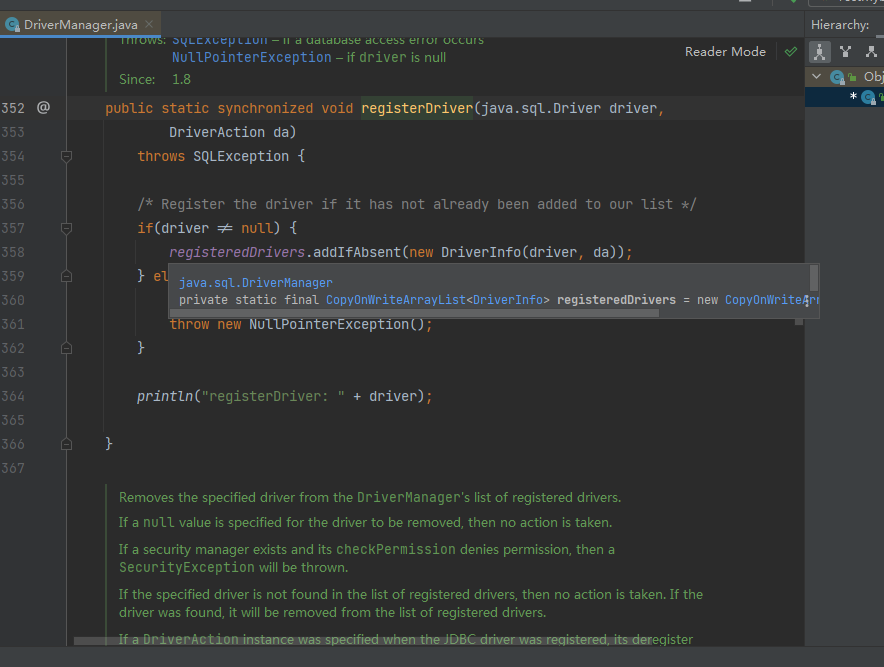
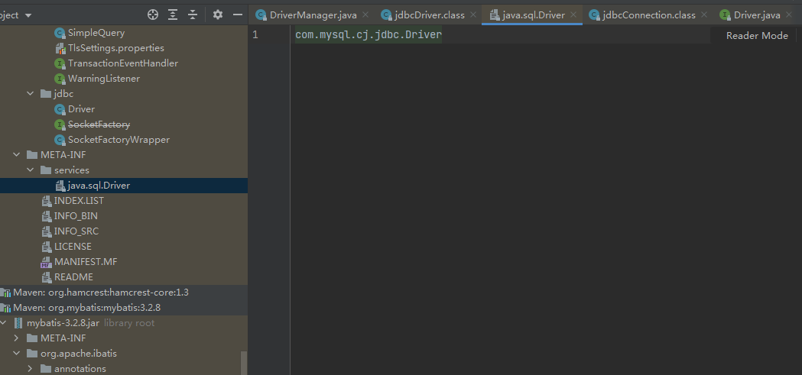
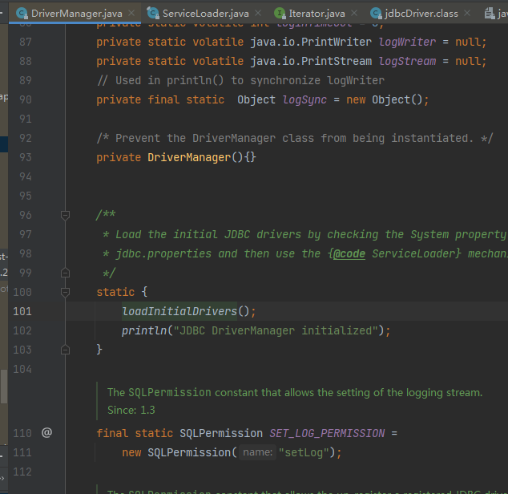
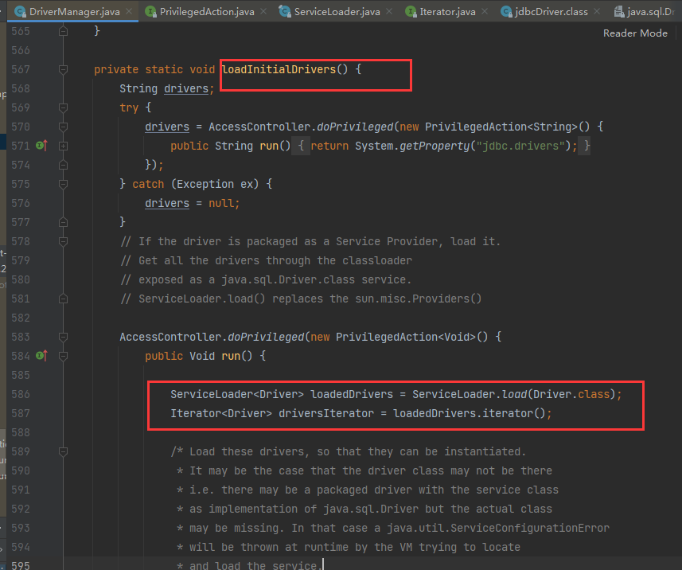
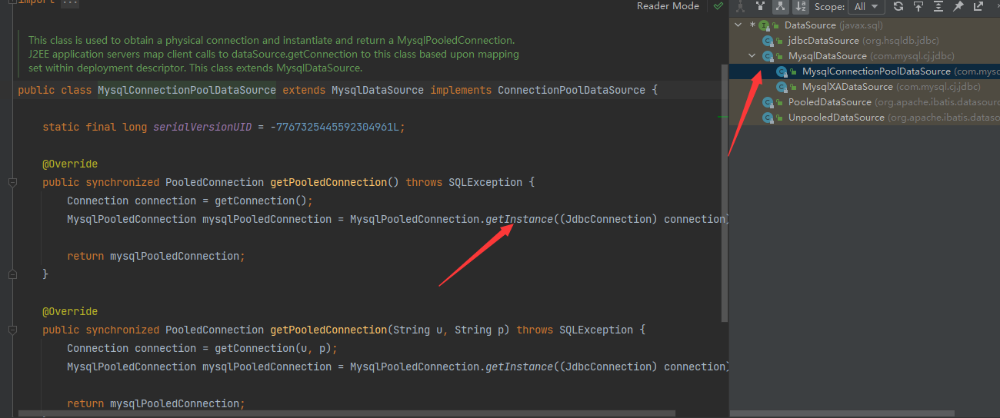

# JDBC基础

### 1.早期连接数据库

这里用的是java实现的hsqldb，一款内存数据库。
早期连接数据库都是如此，基于jdbc，加载驱动，然后从DriverManager获取connection，
操作完后关闭连接等等。
```java
private Connection conn = null;

@Before
public void initData() {
    try {
        Class.forName("org.hsqldb.jdbcDriver");
        conn = DriverManager.getConnection("jdbc:hsqldb:mem:mybatis", "sa", "");
    } catch (Exception e) {
        e.printStackTrace();
    }
}
```

这类操作实际情况就是加载驱动的时候，Class.forName("xxx")后，静态代码块中直接把驱动注册到了jdbc的DriverManager,
之后DriverManage.getConnection就是遍历内部的DriverList，获取到具体数据库厂商的Driver，调用具体Driver的connect方法。
```java

static {
    try {
        DriverManager.registerDriver(new jdbcDriver());
    } catch (Exception var1) {
    }

}
```




### 2.去掉了加载驱动

jdbc4.0之后，jdk基于SPI机制，实现了SPI的厂商无需在加载驱动了，直接DriverManage.getConnection就能获取到具体的连接。
如mysql基于jdbc的SPI，在META-INF下留了个services文件夹，以java.sql.Driver命名的文件。里面是msyql具体的Driver。实现了java.sql.Driver接口


同样，DriverManage的代码是基于ServiceLoader。静态块内执行的方法调用了serviceLoader，加载当前线程下所有实现了java.sql.Driver的实现类。
然后找到的mysql的Driver，静态块内将自己注册到了DriverManager。




### 3.jdbc基础操作
过于基础的几个常用类。
* Statement
  * PreparedStatement
  * CallableStatement 
* ResultSet
* ResultSetMetaData
* Connection
* DriverManger

在jdbc2.0后，javax.sql包扩展出了DataSource。java更推荐使用DataSource而非DriverManger。
官网上说是DataSource抽象成的是资源文件(可以通过JNDI方式加载)，而且他支持分布式事务，还有连接池。
而Datasource也是有各个驱动厂商实现的。


如mysql中，有自己的实现，但是好像资料比较少，而且看代码来说，也并没有做池化技术。(还蛮奇怪的)



mybatis也提供了datasource的实现，PooledDataSource和UnpooledDataSource。
不过目前常用的datasource还是hikari和druid比较多。