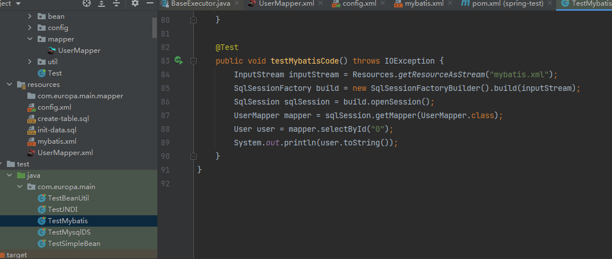
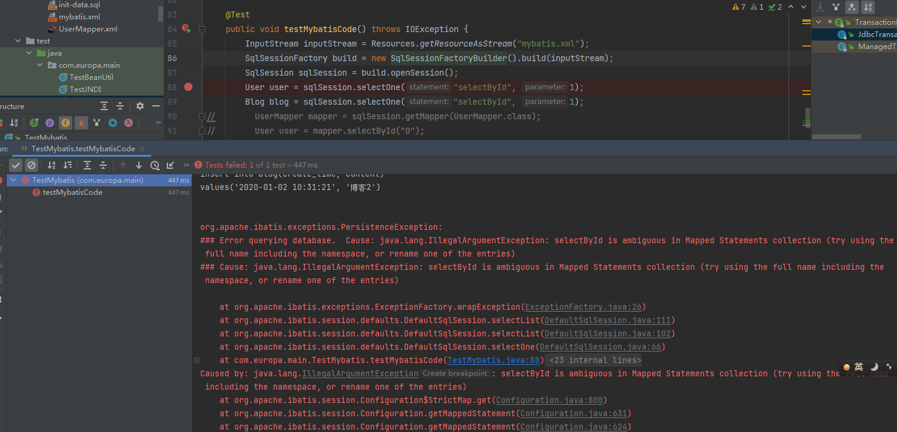
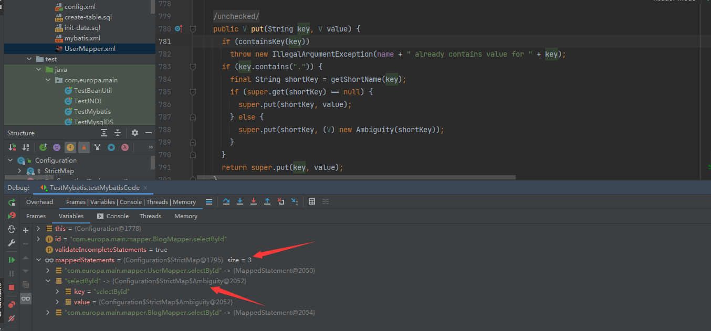
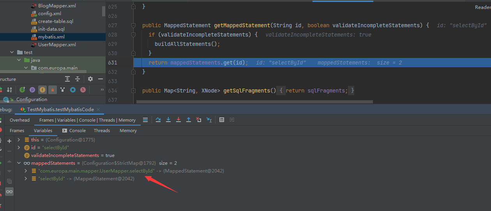

# mybatis

有了jdbc基础，知道了statement和datasource等接口后。跟着官网的示例。看下myabtis源码是怎么封装的jdbc操作。

### 1.项目搭建
基于之前的项目，我还是使用的hsqldb，然后在maven里加入mybatis依赖。
```xml
<dependency>
    <groupId>org.mybatis</groupId>
    <artifactId>mybatis</artifactId>
    <version>3.2.8</version>
</dependency>

<!-- https://mvnrepository.com/artifact/hsqldb/hsqldb -->
<dependency>
    <groupId>hsqldb</groupId>
    <artifactId>hsqldb</artifactId>
    <version>1.8.0.7</version>
    <scope>test</scope>
</dependency>
```

官网推荐使用的xml配置，也可以使用java代码进行配置。
这里直接用了mybatis的PooledDataSource，然后UserMapper.xml放在同级目录
```xml
<?xml version="1.0" encoding="UTF-8" ?>
<!DOCTYPE configuration
        PUBLIC "-//mybatis.org//DTD Config 3.0//EN"
        "https://mybatis.org/dtd/mybatis-3-config.dtd">
<configuration>
    <settings>
        <setting name="cacheEnabled" value="false"/>
    </settings>
    <environments default="development">
        <environment id="development">
            <transactionManager type="JDBC"/>
            <dataSource type="POOLED">
                <property name="driver" value="org.hsqldb.jdbcDriver"/>
                <property name="url" value="jdbc:hsqldb:mem:mybatis"/>
                <property name="username" value="sa"/>
                <property name="password" value=""/>
            </dataSource>
        </environment>
    </environments>
    <mappers>
        <mapper resource="UserMapper.xml"/>
    </mappers>
</configuration>
```

```xml
<?xml version="1.0" encoding="UTF-8" ?>
<!DOCTYPE mapper
        PUBLIC "-//mybatis.org//DTD Mapper 3.0//EN"
        "https://mybatis.org/dtd/mybatis-3-mapper.dtd">
<mapper namespace="com.europa.main.mapper.UserMapper">
    <select id="selectById" resultType="com.europa.main.bean.User">
        select * from user where id = #{id}
    </select>
</mapper>
```


测试代码

```java
@Before
public void initData() {
    try {
        Class.forName("org.hsqldb.jdbcDriver");
        conn = DriverManager.getConnection("jdbc:hsqldb:mem:mybatis", "sa", "");
        ScriptRunner scriptRunner = new ScriptRunner(conn);
        scriptRunner.runScript(Resources.getResourceAsReader("create-table.sql"));
        scriptRunner.runScript(Resources.getResourceAsReader("init-data.sql"));
    } catch (Exception e) {
        e.printStackTrace();
    }
}
@Test
public void testMybatisCode() throws IOException {
    InputStream inputStream = Resources.getResourceAsStream("mybatis.xml");
    SqlSessionFactory build = new SqlSessionFactoryBuilder().build(inputStream);
    SqlSession sqlSession = build.openSession();
    UserMapper mapper = sqlSession.getMapper(UserMapper.class);
    User user = mapper.selectById("0");
    System.out.println(user.toString());
}
```

例子initData用到的两个sql文件如下，这个是某本书上摘录下来的，因为看源码的时候粗略的跟着几本书大致走了下。
```sql
drop table user if exists ;
create table user(
    id int generated by default as identity ,
    create_time varchar(20),
    name varchar(20),
    password varchar(36),
    phone varchar(20),
    nick_name varchar(20),
    primary key (id)
);


insert into user (create_time, name, password, phone, nick_name)
values('2020-01-23 10:30:20', 'user1', 'test', '17521279831', 'huahua');
insert into user (create_time, name, password, phone, nick_name)
values('2020-01-23 10:30:22', 'user2', 'test2', '17521279832', 'huahua2');
```

整体目录结构如下



### 2.源码解析

通过运行上面的例子，已经可以正常获取到查询user了，不用再像jdbc那样一步步获取connenction,然后执行statement,最后获取resultSet进行一个个设置值。
整个查询和操作直接用Object就可以进行操作。

#### 1.getResouceAsStream
进入第一行代码，发现Resources也是mybatis的一个类，类似spring的resouce接口，也是对资源的一些操作封装，底层无非也是class.getResouceAsStream或者ClassLoader.getResouceAsStream等。而mybatis相当于封装了下，搞了个ClassLoader数组wrapper，循环cl获取inputStream，尽量避免加载资源失败。


#### 2.SqlSessionFactoryBuilder
第二行，这个builder提供了多种多样的SqlSessionFactory的build重载，最终还是会落到下面这串代码中(我这里拆出了主体)
```java
public SqlSessionFactory build(InputStream inputStream, String environment, Properties properties) {
    SqlSessionFactory var5;
    XMLConfigBuilder parser = new XMLConfigBuilder(inputStream, environment, properties);
    var5 = this.build(parser.parse());
    return var5;
}
```
先看看这个sqlSessionFactory是什么。点开源码，会发现他主要是获取SqlSession用的，根据名称，那这个就是个sql查询的会话了。
他有两个实现类，DefaultSqlSessionFactory和SqlSessionManager(这个看名称和代码可以确定只是个管理者)，所以基本就是前者作为默认实现。

这个接口内还有几个依赖类，Configuration和Connection等，前者等会再看，而connection就是jdbc的connection了。
所以上面那串代码大致明白了意思，就是解析xml然后builder.build(parser.parse())构建了个sqlSession工厂。
细节再跟着看看。
```java
public interface SqlSessionFactory {

  SqlSession openSession();

  SqlSession openSession(boolean autoCommit);
  SqlSession openSession(Connection connection);
  SqlSession openSession(TransactionIsolationLevel level);

  SqlSession openSession(ExecutorType execType);
  SqlSession openSession(ExecutorType execType, boolean autoCommit);
  SqlSession openSession(ExecutorType execType, TransactionIsolationLevel level);
  SqlSession openSession(ExecutorType execType, Connection connection);

  Configuration getConfiguration();

}
```

主要还是再构造器里做了很多事情，除了解析xml外，构造器内还初始化了上面提到的Configuration，这个类其实还蛮核心的，其实听名字也知道全是配置项。
```java
// 这行代码的EntityResolver明显和spring一样，解析xml时不通过网络下载schemas而走自己的配置进行验证。同时也可以发现，这里好像是只有DTD模式。
public XMLConfigBuilder(InputStream inputStream, String environment, Properties props) {
this(new XPathParser(inputStream, true, props, new XMLMapperEntityResolver()), environment, props);
}

// 这里的createDocument很明显也是和spring相通，通过构造inputSource然后走xml解析那一套。也就是DocumentBuilderFactory和DocumentBuilder.具体代码我不继续往下跟了。明白了意思就好
public XPathParser(Reader reader, boolean validation, Properties variables, EntityResolver entityResolver) {
commonConstructor(validation, variables, entityResolver);
this.document = createDocument(new InputSource(reader));
}

// 回到上一行代码的构造器，还做了一些事情。初始化了configuration
private XMLConfigBuilder(XPathParser parser, String environment, Properties props) {
    super(new Configuration());
    ErrorContext.instance().resource("SQL Mapper Configuration");
    this.configuration.setVariables(props);
    this.parsed = false;
    this.environment = environment;
    this.parser = parser;
}

// 其实这里初始化configuration时，还做了很多别名的映射。主要是配置项和对应类的映射。我挑一些出来
// 发现了这个前面的其实就是配置文件里写的enviroment标签下的type的配置名称，而后面是具体映射到的Class
public Configuration() {
    typeAliasRegistry.registerAlias("JDBC", JdbcTransactionFactory.class);
    typeAliasRegistry.registerAlias("UNPOOLED", UnpooledDataSourceFactory.class);
    typeAliasRegistry.registerAlias("LOG4J", Log4jImpl.class);
    typeAliasRegistry.registerAlias("FIFO", FifoCache.class);
    typeAliasRegistry.registerAlias("JAVASSIST", JavassistProxyFactory.class);
    ...
}
```

继续回到parser.parse，看他其实返回了configuration
```java
// 1.检查
public Configuration parse() {
    if (parsed) {
        throw new BuilderException("Each XMLConfigBuilder can only be used once.");
    }
    parsed = true;
    parseConfiguration(parser.evalNode("/configuration"));
    return configuration;
}

// 2.看到这里和上面的/configuration，具体到xml配置，可以看出来是在解析xml的配置了。由于太多挑一个出来看看
private void parseConfiguration(XNode root) {
    try {
      propertiesElement(root.evalNode("properties")); //issue #117 read properties first
      typeAliasesElement(root.evalNode("typeAliases"));
      pluginElement(root.evalNode("plugins"));
      objectFactoryElement(root.evalNode("objectFactory"));
      objectWrapperFactoryElement(root.evalNode("objectWrapperFactory"));
      settingsElement(root.evalNode("settings"));
      // 拿这个出来看下，因为配置文件有示例，所以好分析
      environmentsElement(root.evalNode("environments")); // read it after objectFactory and objectWrapperFactory issue #631
      databaseIdProviderElement(root.evalNode("databaseIdProvider"));
      typeHandlerElement(root.evalNode("typeHandlers"));
      mapperElement(root.evalNode("mappers"));
    } catch (Exception e) {
      throw new BuilderException("Error parsing SQL Mapper Configuration. Cause: " + e, e);
    }
}

// 3. 环境enviorment先不看，看遍历子Node时，拿到id，解析事务管理器和datasource
// 其实点进去看就可以看到里面用到了之前的typeAlias。与xml的和前面的代码对上了。
// 最后讲datasource和transactionFactory装入env然后装入configuration，其他的configuration装载我这里不一一写，但是都很重要。属于是核心代码了
private void environmentsElement(XNode context) throws Exception {
    if (context != null) {
      if (environment == null) {
        environment = context.getStringAttribute("default");
      }
      for (XNode child : context.getChildren()) {
        String id = child.getStringAttribute("id");
        if (isSpecifiedEnvironment(id)) {
          TransactionFactory txFactory = transactionManagerElement(child.evalNode("transactionManager"));
          DataSourceFactory dsFactory = dataSourceElement(child.evalNode("dataSource"));
          DataSource dataSource = dsFactory.getDataSource();
          Environment.Builder environmentBuilder = new Environment.Builder(id)
              .transactionFactory(txFactory)
              .dataSource(dataSource);
          configuration.setEnvironment(environmentBuilder.build());
        }
      }
    }
  }
```

走到这里，就基本完成了configuration的设置，然后又要回到SqlSessionFactoryBuilder那
```java
public SqlSessionFactory build(Configuration config) {
    return new DefaultSqlSessionFactory(config);
}
```

### 3.SqlSession

获取到sqlSessionFactory后，openSession获取了一个会话
```java
public SqlSession openSession() {
    return openSessionFromDataSource(configuration.getDefaultExecutorType(), null, false);
}

private SqlSession openSessionFromDataSource(ExecutorType execType, TransactionIsolationLevel level, boolean autoCommit) {
    Transaction tx = null;
    try {
      final Environment environment = configuration.getEnvironment();
      final TransactionFactory transactionFactory = getTransactionFactoryFromEnvironment(environment);
      tx = transactionFactory.newTransaction(environment.getDataSource(), level, autoCommit);
      final Executor executor = configuration.newExecutor(tx, execType);
      return new DefaultSqlSession(configuration, executor, autoCommit);
    } catch (Exception e) {
      closeTransaction(tx); // may have fetched a connection so lets call close()
      throw ExceptionFactory.wrapException("Error opening session.  Cause: " + e, e);
    } finally {
      ErrorContext.instance().reset();
    }
  }

```

上面的代码，可以看到是从数据库获取会话，而从数据库，那必然是jdbc connection那一套。
还是先看下sqlSession是什么,截取了部分方法，可以看出来，他和名称很相符，一次sql会话，不过明显是基于jdbc的connection，然后封装了一些自己的方法。
```java
public interface SqlSession extends Closeable {
    <T> T selectOne(String statement);
    <T> T selectOne(String statement, Object parameter);
    <E> List<E> selectList(String statement);
    void select(String statement, Object parameter, ResultHandler handler);
    int insert(String statement);
    int update(String statement);
    int delete(String statement);
    void commit();
    void rollback();
    <T> T getMapper(Class<T> type);
    Configuration getConfiguration();
    Connection getConnection();
}
```

默认的实现类如下
```java
public class DefaultSqlSession implements SqlSession {

  private Configuration configuration;
  private Executor executor;

  private boolean autoCommit;
  private boolean dirty;
  
  public DefaultSqlSession(Configuration configuration, Executor executor, boolean autoCommit) {
    this.configuration = configuration;
    this.executor = executor;
    this.dirty = false;
    this.autoCommit = autoCommit;
  }

  // 挑一个方法实现看看是怎么做的
  public <E> List<E> selectList(String statement, Object parameter, RowBounds rowBounds) {
    try {
      MappedStatement ms = configuration.getMappedStatement(statement);
      List<E> result = executor.query(ms, wrapCollection(parameter), rowBounds, Executor.NO_RESULT_HANDLER);
      return result;
    } catch (Exception e) {
      throw ExceptionFactory.wrapException("Error querying database.  Cause: " + e, e);
    } finally {
      ErrorContext.instance().reset();
    }
  }
}
```

#### 3.1 TransactionFactory
到这里大致可以看出来环绕这sqlsession的几个类。Executor、Configuration、TransactionFactory、Environment
configuration和environment之前有接触，先不看大概明白是配置和环境
TransactionFactory其实也是之前解析xml时根据xml的TYPE alias到的具体类，JdbcTransactionFactory。
这里又发现mybatis有个Transaction，点进去很快能明白，就是基于jdbc的connection对数据库的事务做了个封装。
```java
public interface TransactionFactory {
  void setProperties(Properties props);
  Transaction newTransaction(Connection conn);
  Transaction newTransaction(DataSource dataSource, TransactionIsolationLevel level, boolean autoCommit);
}

public interface Transaction {
  Connection getConnection() throws SQLException;
  void commit() throws SQLException;
  void rollback() throws SQLException;
  void close() throws SQLException;
}
```

#### 3.2 Executor
而executor是什么，继续跟着看,看到这里其实大概也理解了，sqlSession其实是executor更上一层的抽象，或者说一个是会话，
针对用户CURD的封装，而executor更偏底层，是具体执行Statement的实现。
这里又用到了MappedStatement，映射完成的Statement。
```java
public interface Executor {
  ResultHandler NO_RESULT_HANDLER = null;
  int update(MappedStatement ms, Object parameter) throws SQLException;
  <E> List<E> query(MappedStatement ms, Object parameter, RowBounds rowBounds, ResultHandler resultHandler, CacheKey cacheKey, BoundSql boundSql) throws SQLException;
  <E> List<E> query(MappedStatement ms, Object parameter, RowBounds rowBounds, ResultHandler resultHandler) throws SQLException;
  List<BatchResult> flushStatements() throws SQLException;
  void commit(boolean required) throws SQLException;
  void rollback(boolean required) throws SQLException;
  CacheKey createCacheKey(MappedStatement ms, Object parameterObject, RowBounds rowBounds, BoundSql boundSql);
  boolean isCached(MappedStatement ms, CacheKey key);
  void clearLocalCache();
  void deferLoad(MappedStatement ms, MetaObject resultObject, String property, CacheKey key, Class<?> targetType);
  Transaction getTransaction();
  void close(boolean forceRollback);
  boolean isClosed();
  void setExecutorWrapper(Executor executor);

}
```

#### 3.3 MappedStatement
关于这个MappedStatement，有点特殊，这里看selectList时，从configuration获取的ms,
跟进去看会发现他是从下面这个map中直接get(statement)这样获取的。
而这个map的put代码只有一处，这样看何时加载的就很简单了。
```java
protected final Map<String, MappedStatement> mappedStatements = new StrictMap<MappedStatement>("Mapped Statements collection");
```

继续跟进后会发现真没那么简单，这里用到了assistant技术，也就是说这个玩意是字节码操作进来的。
下面这个代码调用有几处，大致为annotation注入和xml解析注入。
跟着xml的调用一直回溯会发现最终是之前解析xml时，parseConfiguration方法里那一大串
mapperElement(root.evalNode("mappers"))
这里面最终调用方就是上面这个，而回溯出来也就发现他这个MappedStatement其实就是我们自己编写的各种各样的Mapper.xml里面的玩意。
```java
public class MapperBuilderAssistant {
public MappedStatement addMappedStatement(
      String id,
      SqlSource sqlSource,
      StatementType statementType,
      SqlCommandType sqlCommandType,
      Integer fetchSize,
      Integer timeout,
      String parameterMap,
      Class<?> parameterType,
      String resultMap,
      Class<?> resultType,
      ResultSetType resultSetType,
      boolean flushCache,
      boolean useCache,
      boolean resultOrdered,
      KeyGenerator keyGenerator,
      String keyProperty,
      String keyColumn,
      String databaseId,
      LanguageDriver lang,
      String resultSets) {
    
    if (unresolvedCacheRef) throw new IncompleteElementException("Cache-ref not yet resolved");
    
    id = applyCurrentNamespace(id, false);
    boolean isSelect = sqlCommandType == SqlCommandType.SELECT;

    MappedStatement.Builder statementBuilder = new MappedStatement.Builder(configuration, id, sqlSource, sqlCommandType);
    statementBuilder.resource(resource);
    statementBuilder.fetchSize(fetchSize);
    statementBuilder.statementType(statementType);
    statementBuilder.keyGenerator(keyGenerator);
    statementBuilder.keyProperty(keyProperty);
    statementBuilder.keyColumn(keyColumn);
    statementBuilder.databaseId(databaseId);
    statementBuilder.lang(lang);
    statementBuilder.resultOrdered(resultOrdered);
    statementBuilder.resulSets(resultSets);
    setStatementTimeout(timeout, statementBuilder);

    setStatementParameterMap(parameterMap, parameterType, statementBuilder);
    setStatementResultMap(resultMap, resultType, resultSetType, statementBuilder);
    setStatementCache(isSelect, flushCache, useCache, currentCache, statementBuilder);

    MappedStatement statement = statementBuilder.build();
    configuration.addMappedStatement(statement);
    return statement;
  }
}
```

#### 3.4 sqlsession总结
到这里大概可能忘了很多，我整理下，关键的一些接口
```java
SqlSession
Executor
MappedStatement
Transaction
```
也就是说，解析xml时，通过xml与字节码技术将mapper解析到MappedStatement，
然后用户通过调用SqlSession.selectList(String statement)，这个statment其实就是mapper.xml里的id。
获取到结果，而底层是通过executor去执行的。

那是不是说，我客户端调用的代码可以这么写。

```java
@Test
public void testMybatisCode() throws IOException {
    InputStream inputStream = Resources.getResourceAsStream("mybatis.xml");
    SqlSessionFactory build = new SqlSessionFactoryBuilder().build(inputStream);
    SqlSession sqlSession = build.openSession();
    User user = sqlSession.selectOne("selectById", 1);
//        UserMapper mapper = sqlSession.getMapper(UserMapper.class);
//        User user = mapper.selectById("0");
    System.out.println(user.toString());
}
```

通过测试，验证了想法是正确的。
但是问题来了，假如我两个不同的xml，有相同的id，看这里代码应该是无法正确处理的。
试了下也证实了我的猜想，而mybatis给出的提示也很精准，指出了id是有二义性的，要么改名，要么写全namespace。
按他的提示试了下，确实可以解决二义性问题。这里好奇的debug看了下原因。
其实是他自己实现内部的map重写了put和get方法，同时讲简短的名称和包含namespace的名称全部丢进了map，而id重复的value则被包装成了Ambiguity对象。
```java
protected static class StrictMap<V> extends HashMap<String, V> {
 public V put(String key, V value) {
      if (containsKey(key))
        throw new IllegalArgumentException(name + " already contains value for " + key);
      if (key.contains(".")) {
        final String shortKey = getShortName(key);
        if (super.get(shortKey) == null) {
          super.put(shortKey, value);
        } else {
          super.put(shortKey, (V) new Ambiguity(shortKey));
        }
      }
      return super.put(key, value);
    }

    public V get(Object key) {
      V value = super.get(key);
      if (value == null) {
        throw new IllegalArgumentException(name + " does not contain value for " + key);
      }
      if (value instanceof Ambiguity) {
        throw new IllegalArgumentException(((Ambiguity) value).getSubject() + " is ambiguous in " + name
            + " (try using the full name including the namespace, or rename one of the entries)");
      }
      return value;
    }
}
```


