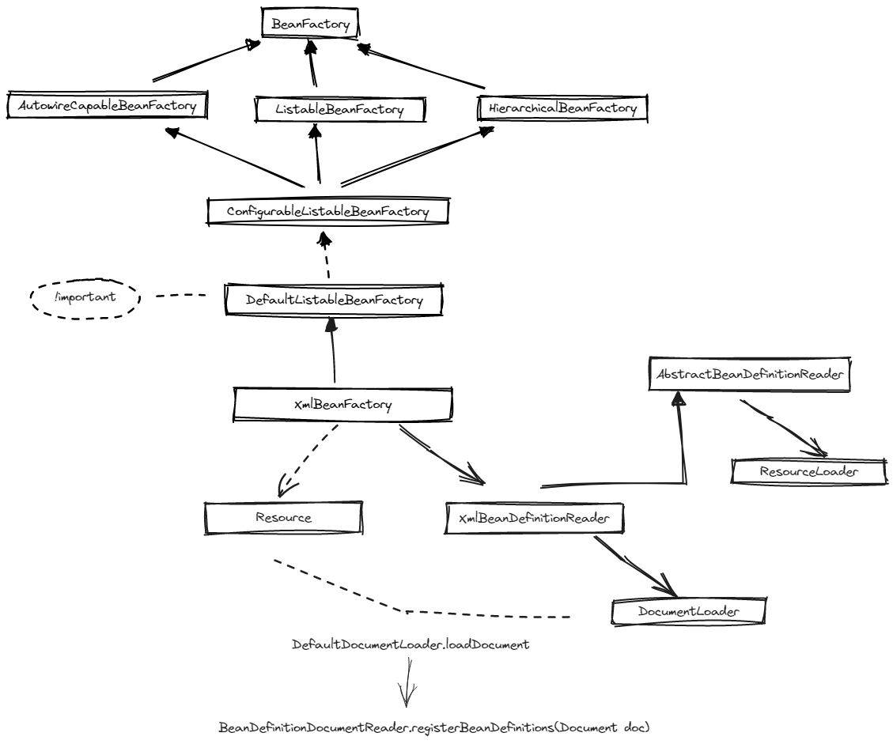
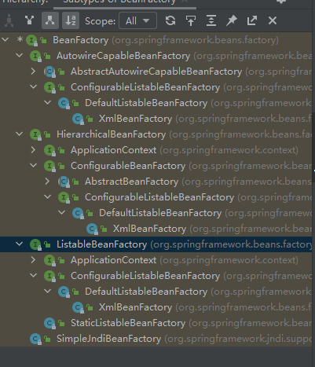

# Spring-Beans

spring版本为5.2.20.RELEASE,根据BeanFactory画了下草图。
大概流程就是DefaultListableBeanFactory比较重要，实现了三个接口，分别为BeanFactory下的底层接口。
而XmlBeanFactory（虽然已经弃用，但用来跟源码很使用）继承了DefaultListable...
但是其中他关联了XmlBeanDefinitionReader，而此Reader内部关联了DocumentLoader将Resource解析成document，后续做xml解析，并注册beanDefinition
父类的AbstractBeanDefinitionReader内部关联的是大家都很熟悉的ResourceLoader

